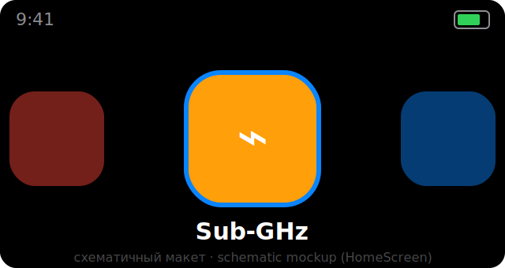
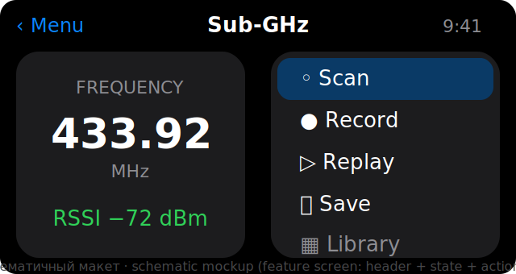
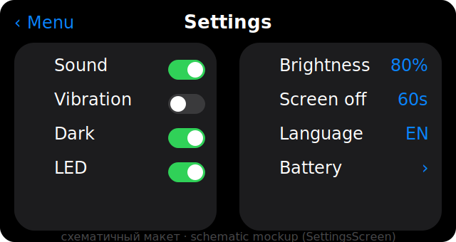
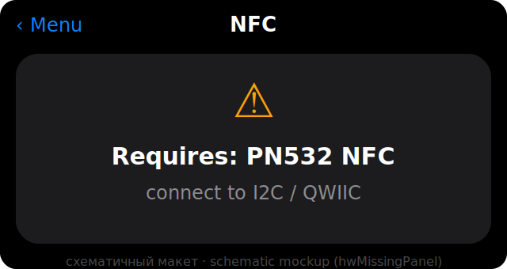

# VARSYS — UI-фреймворк

🌐 [English](UI.md) · **Русский**

UI на **LVGL 8.3**, ландшафт **320×170** (ST7789, rotation 3), стиль iOS
(спрингборд из плиток). Шрифты собственные (Inter + кириллица + иконки Tabler).

## Экраны (макеты)
> ⚠️ Ниже — **схематичные макеты** раскладки, а не снимки с устройства
> (реальный захват экрана — задача на железе, см. [BACKLOG](../BACKLOG.md)).

| Главный экран | Экран функции |
|---|---|
|  |  |
| Настройки | Нет железа |
|  |  |

---

## 1. Screen (`ui/Screen.h`)
Базовый класс. Каждый экран владеет своим `lv_obj_t* _root`. Методы:
`name`, `onCreate(parent)`, `onShow/onHide`, `onUpdate(now)`, `onEvent(e)`.
⚠️ `onCreate` зовётся при сборке И пересборке (`retranslateAll`). Лениво созданные
дочерние объекты (напр. `_hwPanel`) обнуляйте в начале `onCreate` (старый удалён
`lv_obj_clean`).

## 2. UIManager (`ui/UIManager.*`)
Модуль и владелец LVGL.
- `init()`: Display + `lv_init` + буферы (`heap_caps_malloc`, `kBufLines`) +
  `flushCb`. **Экраны не строит.**
- `start()`: `buildScreens()` → `setScreen("Home")` → `Splash::play` + подписки.
- `update()`: `lv_timer_handler` + `active->onUpdate`.
- Навигация: `setScreen(name)` (верхний уровень), `pushScreen(name)` (в стек),
  `popScreen()`. «Назад»/долгое нажатие → `popScreen()`.
- `retranslateAll()`: смена языка/темы → `lv_obj_clean+onCreate` всем.
- `flushCb`: пуш буфера в TFT под `hal::SpiBusGuard`.

## 3. UITheme (`ui/UITheme.*`)
Цвета-функции, ветвятся по `ui::darkMode`: `cBg/cCard/cText/cText2/cSep/cBlue/
cGreen/cOrange/cRed/cGray/cTint`. Фабрики: `styleScreen`, `header`, `card`,
`hwMissingPanel(parent,"PN532 NFC","I2C / QWIIC")`. Тёмная тема по умолчанию.

## 4. Локализация (`ui/i18n.*`)
`enum StrId` + `tr(StrId)`. Две позиционные таблицы `RU[]/EN[]` (порядок = enum).
Смена языка → `LANG_CHANGED` → `retranslateAll`. По умолчанию English.

## 5. Шрифты (`ui/fonts/`)
`varsys_12/14/16/22` (Inter + кириллица + иконки Tabler). Макросы `ICON_*`.
⚠️ Шрифты **сжатые** → в `include/lv_conf.h` обязателен `LV_USE_FONT_COMPRESSED 1`.
Генератор: `tools/fonts/generate_fonts.py`.

## 6. Оверлеи
- **Splash** — анимированный логотип на `lv_layer_top` (`create/play`).
- **StatusOverlay** — статус-бар (время+заряд) на `lv_layer_top`.
- **Notify** — тосты `Notify::toast(text, Info|Success|Warn|Error)`.

## 7. Экраны (`ui/screens/`)
Регистрируются в `buildScreens()`, открываются по `name()`:
Home, SubGhz, Spectrum, SavedSignals, Brute, Ir, IrRemote, Nfc, Wifi, Ble,
Badusb, Mousejack, Nrf, Gps, Wardrive, IButton, Fm, WebUi, Files, Battery,
Settings, Expert, Portal, DevTools.

**HomeScreen** — горизонтальная карусель: плитки 72px, фокус в центре, прокрутка
мгновенная (`LV_ANIM_OFF` — без тиринга), focus через прозрачность (не
`transform_zoom`). Каждая плитка хранит цвет → `LedModule::setColor` при фокусе.

Рецепты — [EXTENDING](EXTENDING.ru.md).
